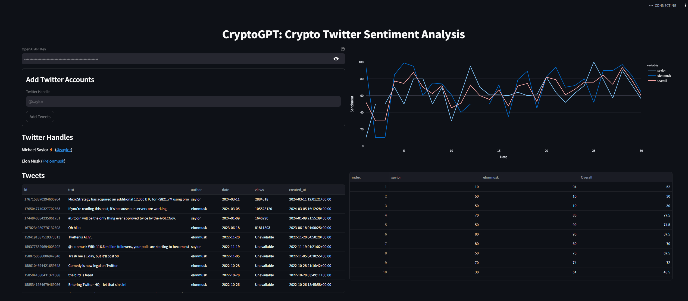

# CryptoGPT: Crypto Twitter Sentiment Analysis

Welcome to CryptoGPT! 

This project aims to provide a user-friendly web application to analyze the sentiment of posts from crypto-related Key Opinion Leaders (KOLs), helping users make informed decisions effectively. Leveraging prompt engineering, I created prompt templates for ChatGPT and utilized the LangChain API to automatically compute sentiment score. The application visualizes the data and trend line charts using Streamlit, offering an intuitive interface for easy interaction with the sentiment analysis tool. This ensures a seamless and effortless user experience, enabling users to engage with the sentiment analysis application efficiently.

## Project Setup

Use Python 3.11.3 for this project, and the directory structure will be as follows:
```bash
.
├── .flake8
├── .gitignore
├── .python-version
├── .vscode
│   └── settings.json
├── main.py
├── requirements.txt
└── sentiment_analyzer.py
```

### Libraries

Install the required libraries:

```bash
pip install streamlit plotly
pip install langchain-community langchain-core
pip install https://github.com/mahrtayyab/tweety/archive/main.zip --upgrade
```

### Config

Use `black` and `isort` for formatting and import sorting. Additionally, we'll configure VSCode for the project.

### Streamlit

Streamlit is an open-source Python library designed for building custom web applications with ease. It can create interactive and visually appealing data-driven applications using Python. With Streamlit, we can quickly transform our data analysis code into shareable web applications, making it ideal for our sentiment analysis project.

## Get Tweets

To fetch tweets for our analysis, we'll make use of the `tweety` library. This library interacts with Twitter's frontend API to retrieve the desired tweets. Take input user "elonmusk" as example:
```
from tweety import Twitter
twitter_client = Twitter("session")

tweets = twitter_client ("elonmusk")
for tweet in tweets:
    print(tweet.text)
    print()
```
### Clean Tweets

Remove unnecessary elements like URLs, new lines, and multiple spaces from the tweets, as they are not relevant for our sentiment analysis and will save tokens for ChatGPT.

```python
import re

def clean_tweet(text: str) -> str:
    text = re.sub(r"http\S+", "", text)
    text = re.sub(r"www.\S+", "", text)
    return re.sub(r"\s+", " ", text)
```

### Create DataFrame

Use a dataframe to organize and easily visualize the tweets.

```python
import pandas as pd

def create_dataframe_from_tweets(tweets: List[Tweet]) -> pd.DataFrame:
    rows = []
    for tweet in tweets:
        clean_text = clean_tweet(tweet.text)
        if len(clean_text) == 0:
            continue
        rows.append(
            {
                "id": tweet.id,
                "text": clean_text,
                "author": tweet.author.username,
                "date": str(tweet.date.date()),
                "created_at": tweet.date,
                "views": tweet.views,
            }
        )
 
    df = pd.DataFrame(
        rows,
        columns=["id", "text", "author", "date", "views", "created_at"]
    )
    df.set_index("id", inplace=True)
    return df
```

## Tweet Data UI
Our UI will have a straightforward design, with a split-screen layout consisting of two columns. The left column will be dedicated to loading the data. It will require two pieces of information from the user - the OpenAI API key and the Twitter handles. And there is a section displaying the tweets in a dataframe format using the create_dataframe_from_tweets function. Please check main.py for details.

## Sentiment Analysis

We'll use ChatGPT and LangChain to analyze the sentiment of the tweets.

```python
from langchain.llms import ChatOpenAI
from langchain.chains import LLMChain
from langchain.prompts import PromptTemplate

def analyze_sentiment(twitter_handle: str, tweets: List[Tweet]) -> Dict[str, int]:
    chat_gpt = ChatOpenAI(temperature=0, model_name="gpt-3.5-turbo")
    prompt = PromptTemplate(
        input_variables=["twitter_handle", "tweets"], template=PROMPT_TEMPLATE)
 
    sentiment_chain = LLMChain(llm=chat_gpt, prompt=prompt)
    response = sentiment_chain(
        {
            "twitter_handle": twitter_handle,
            "tweets": create_tweet_list_for_prompt(tweets, twitter_handle),
        }
    )
    return json.loads(response["text"])
```


## Visualize Sentiment

Utilize st.plotly_chart to visualize the sentiment. We can generate a line chart to visualize the sentiment trends. 

```python
with col2:
    sentiment_df = create_sentiment_dataframe(st.session_state.author_sentiment)
    if not sentiment_df.empty:
        fig = px.line(
            sentiment_df,
            x=sentiment_df.index,
            y=sentiment_df.columns,
            labels={"date": "Date", "value": "Sentiment"},
        )
        fig.update_layout(yaxis_range=[0, 100])
        st.plotly_chart(fig, theme="streamlit", use_container_width=True)
 
        st.dataframe(sentiment_df, use_container_width=True)
```


## Conclusion and Futrue Improvements

In this project, I developed a straightforward Streamlit application to interact with a crypto sentiment analysis pipeline, effectively assisting users in reviewing various feeds and daily posts about cryptocurrency. The application includes features for downloading and preprocessing tweets, computing sentiment scores using LangChain and the ChatGPT API, and visualizing sentiment data within the Streamlit app. However, the analysis is constrained by the limitations of the Tweety API, which restricts the number of tweets that can be retrieved for each input author, hindering the ability to perform a comprehensive real-time sentiment analysis. Future improvements include selecting and evaluating an appropriate LLM model and adding functionality to delete previous inputs.
